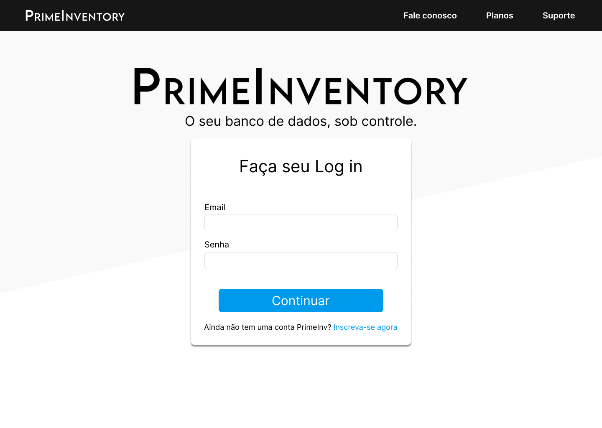

# README: Prime Inventory
# Desenvolvido por:
<a href="https://www.linkedin.com/in/inacio-santana/">Inácio Santana<a>
 
<a href="https://www.linkedin.com/in/jhonatan-dias-farias/">Jhonatan Dias<a>
 
<a href= "https://www.linkedin.com/in/rafael-gomes-a7b56a230/"> Rafael Gomes<a>
 
<a href="https://www.linkedin.com/in/vinicius-de-paula-791466290/">Vinicius de Paula<a>

# Link do site

# Video de apresentação

# Documentação
A documentação está na pasta "DOC/Doc_Primeinventory"

## Visão Geral
O Prime Inventory é um sistema de gestão de estoque desenvolvido para facilitar o controle e a administração de produtos em um ambiente empresarial. Ele utiliza diversas tecnologias modernas para oferecer uma experiência eficiente e segura para os usuários.

# Tecnologias Utilizadas
## Frontend:

HTML
CSS
Bootstrap
Vue.js

## Backend:

MySQL | NodeJS | JavaScript

# Funcionalidades Principais
## Cadastro de Produtos:

Permite o cadastro de novos produtos no sistema, incluindo informações como nome, descrição, quantidade em estoque e preço.
## Atualização de Produtos:

Permite atualizar as informações de produtos existentes, como alterar o preço ou a descrição.
## Exclusão de Produtos:

Permite deletar itens do sistema, removendo completamente suas informações do banco de dados.
## Pesquisa de Produtos:

Oferece uma funcionalidade de pesquisa que permite encontrar produtos por nome ou categoria, exibindo uma lista detalhada dos itens disponíveis.

# Modelo logico e conceitual Banco de Dados

# Prototipação

## Tela inicial

## Planos

## Login

## Cadastro

## Gerenciamento

# Site final

